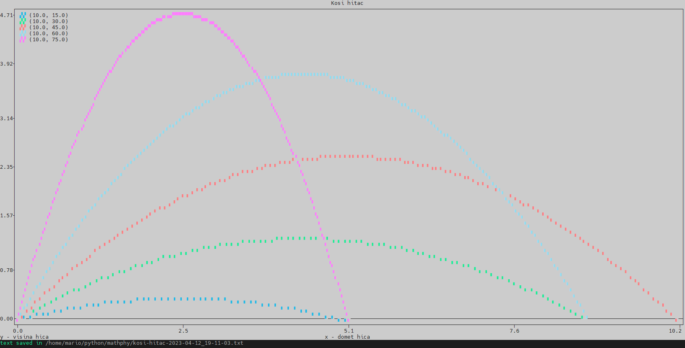
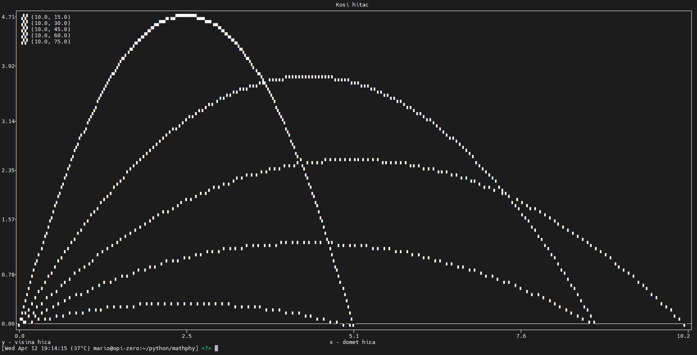
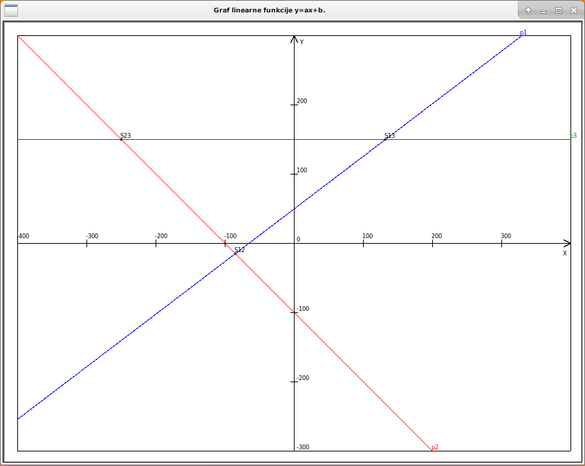
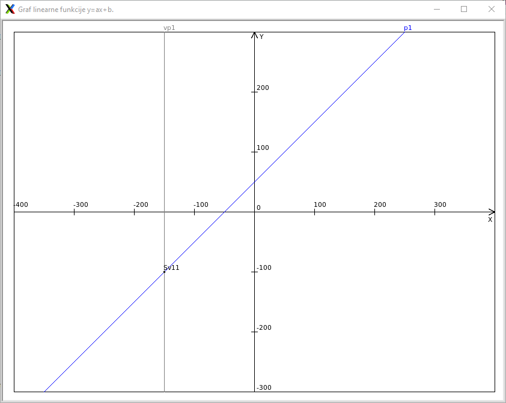
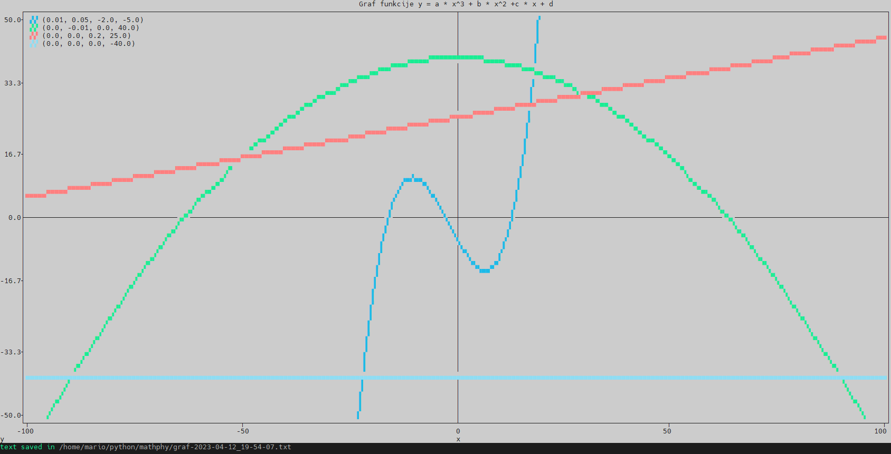
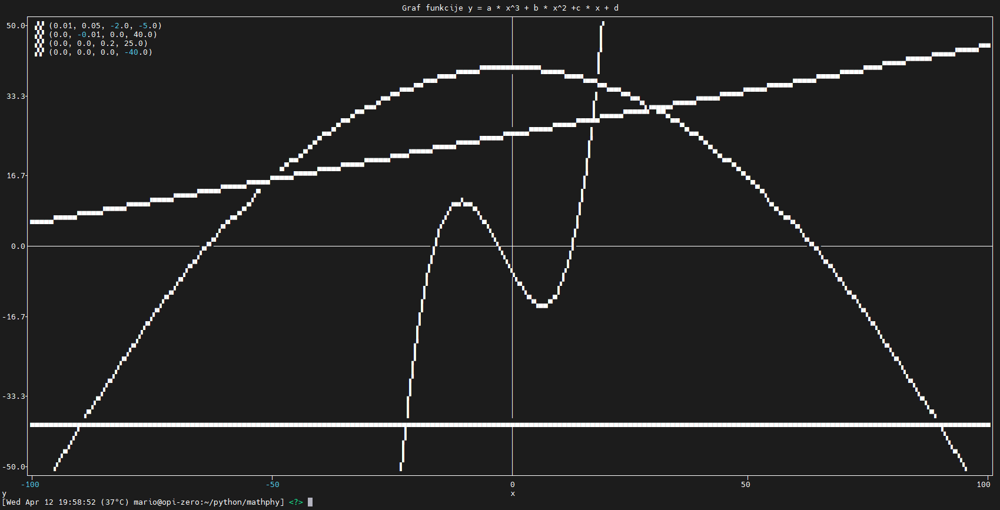

# python-matematika-fizika (osnovna i srednja škola)
Primjena pythona u školskim matematičkim i fizikalnim problemima.

**kosi-hitac.py**
  - crtanje putanje (x,y) kosog hica definiranog početnom brzinom i kutem hica u stupnjevima
  - koristi se plotext modul za plotanje grafike u terminalu
  - snimanje u .txt i .html (.txt nije u boji)

**linearna-funkcija.py**
  - crtanje grafa linearne funckije (pravca)
  - izračun sjecišta pravaca
  - snimanje slike u .eps i .jpg formatu
  - easter egg: funkcija-ab.txt
  

**linearna-funkcija-v2.py
  - vertikalni pravac, x=konstanta
  - sjecište pravca s vertikalnim pravcem

  
**polinom3.py**
  - crtanje grafa polinoma ax^3+bx^2+cx+d (unose se koeficijenti a, b, c, d)
  - koristi se plotext modul za plotanje u terminalu
  - snimanje u .txt i .html (.txt nije u boji)

